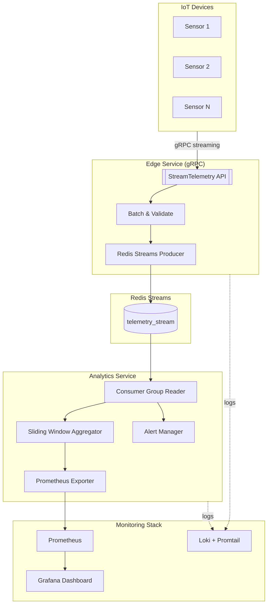

# 🌐 Real‑Time IoT Telemetry Platform


> **Распределённая система сбора, агрегации и анализа телеметрии от IoT‑устройств в реальном времени**  
> Поддержка потокового взаимодействия, алертов и мониторинга через Prometheus + Grafana.

---

## 📑 Оглавление

- [Описание](#-описание)
- [Архитектура](#-архитектура)
- [Ключевые возможности](#-ключевые-возможности)
- [Технологический стек](#-технологический-стек)
- [Зависимости](#-зависимости)
- [Проверка окружения](#-проверка-окружения)
- [Быстрый старт](#-быстрый-старт)
- [Примеры API](#-примеры-api)
- [Мониторинг и алерты](#-мониторинг-и-алерты)
- [Лицензия](#-лицензия)

---

## 📝 Описание

**Real‑Time IoT Telemetry Platform** — это набор микросервисов для сбора и анализа данных от IoT‑датчиков (температура, влажность и т.д.) в режиме реального времени.

Платформа позволяет:
- Принимать и обрабатывать потоковые данные от устройств (**Edge Service**)
- Буферизировать их в **Redis Streams**
- Выполнять агрегацию и вычисление метрик (avg/min/max/stddev) (**Analytics Service**)
- Генерировать автоматические алерты при превышении порогов
- Экспортировать метрики в **Prometheus** и визуализировать их в **Grafana**

---

## 🏗 Архитектура



---

## 🚀 Ключевые возможности

- 📡 Потоковая передача данных от устройств через gRPC
- ⚡ Сбор и буферизация в Redis Streams
- 📊 Реальное время — агрегация, статистика, алерты
- 🔔 Пороговые уведомления
- 📈 Мониторинг в Prometheus и дашборды в Grafana
- 🐳 Контейнеризация через Docker/Docker Compose
- 📝 Централизованное логирование через Loki + Promtail

---

## 🛠 Технологический стек

- **Язык:** C++20
- **Сетевое взаимодействие:** gRPC, Protobuf
- **Хранилище/очередь:** Redis Streams
- **Метрики:** Prometheus C++ Client
- **Логирование:** spdlog, Loki
- **Мониторинг:** Prometheus, Grafana
- **Сборка:** CMake, Conan
- **Инфраструктура:** Docker, docker-compose

---

## 📦 Зависимости

Перед запуском убедитесь, что у вас установлены следующие инструменты:

| Компонент          | Минимальная версия | Назначение                          | Установка                              |
|--------------------|--------------------|-------------------------------------|----------------------------------------|
| **Docker**         | 20.10+             | Контейнеризация и запуск сервисов   | [docker.com](https://www.docker.com/)  |
| **Docker Compose** | 1.29+              | Оркестрация многоконтейнерного окружения | входит в Docker Desktop           |
| **CMake**          | 3.20+              | Сборка C++‑проектов                 | `sudo apt install cmake` или [cmake.org](https://cmake.org/) |
| **Conan**          | 2.0+               | Управление зависимостями C++        | `pip install conan` или [conan.io](https://conan.io/) |
| **Python**         | 3.8+               | Примеры gRPC‑клиентов               | `sudo apt install python3`             |
| **pip**            | latest             | Установка Python‑библиотек          |                |

> 💡 Все основные зависимости уже включены в Docker‑контейнеры.  
> Но если вы хотите собирать проект локально — потребуется CMake и Conan.

---

## 🧪 Проверка окружения

```bash
# Проверка версий
docker --version
docker-compose --version
cmake --version
conan --version
python3 --version
```

---

## ⚡ Быстрый старт

```bash
# 1) Клонировать репозиторий
git clone https://github.com/realht/IoT_monitor.git
cd iot-realtime-platform

# 2) (Опционально) Подредактировать .env при необходимости
# REDIS_HOST=tcp://redis:6379
# EDGE_SERVICE_ADDRESS=0.0.0.0:50051
# ANALYTICS_SERVICE_ADDRESS=0.0.0.0:50052
# PROMETHEUS_ADDRESS=0.0.0.0:8081
# ... логирование

# 3) Запустить всю платформу
docker-compose up --build

```

- **Edge Service:** localhost:50051
- **Analytics Service:** localhost:50052
- **Prometheus:** http://localhost:9090
- **Grafana:** http://localhost:3000 (anonymous enabled)
- **Loki:** http://localhost:3100

---

## 🔌 Примеры API

### 📚 Python‑библиотеки для примеров

Если вы хотите запустить примеры API‑клиентов на Python, установите:

```bash
pip install grpcio grpcio-tools protobuf
```

1) **Edge Service**: отправка телеметрии (gRPC stream)

```python
# examples/edge_client.py
import grpc, time
import edge_service_pb2 as pb
import edge_service_pb2_grpc as api
from google.protobuf.timestamp_pb2 import Timestamp

channel = grpc.insecure_channel("localhost:50051")
stub = api.EdgeServiceStub(channel)

def telemetry_stream():
    for i in range(10):
        ts = Timestamp(seconds=int(time.time()))
        yield pb.SensorData(
            device_id="sensor-1",
            temperature=25.5 + i,
            humidity=40.0 + i,
            timestamp=ts
        )
        time.sleep(0.5)

ack = stub.StreamTelemetry(telemetry_stream())
print("Server response:", ack)

```

2) **Analytics Service**: подписка на статистику (server streaming)

```python
# examples/analytics_stats_client.py
import grpc
import analytics_service_pb2 as pb
import analytics_service_pb2_grpc as api

channel = grpc.insecure_channel("localhost:50052")
stub = api.AnalyticsServiceStub(channel)

req = pb.StatRequest(
    device_id=["sensor-1"],
    aggregation=pb.StatRequest.AVG,
    window_seconds=30
)

for resp in stub.GetRealtimeStats(req):
    print("metrics:", dict(resp.metrics), "ts:", resp.timestamp)
```

3) **Analytics Service**: подписка на алерты

```python
# examples/analytics_alerts_client.py
import grpc
import analytics_service_pb2 as pb
import analytics_service_pb2_grpc as api

channel = grpc.insecure_channel("localhost:50052")
stub = api.AnalyticsServiceStub(channel)

sub = pb.AlertSubscription(
    device_ids=["sensor-1"],
    metric_types=["temperature"],
    severity_levels=["critical", "warning"]
)

for alert in stub.SubscribeToAlerts(sub):
    print(f"[ALERT] {alert.device_id} {alert.metric_type}={alert.current_value} severity={alert.severity}")
```

---

## 📊 Мониторинг и алерты

- **Метрики Prometheus:** доступны по адресу http://localhost:8081/metrics
- **Grafana Dashboard:** автоматически разворачивается, доступен на http://localhost:3000
- **Loki:** централизованное логирование, просмотр через Grafana Explore

**Пример Grafana Dashboard:** [Скриншот интерфейса](Grafan_Dashboard.png)

---
## 📜 Лицензия

Этот проект распространяется по лицензии MIT — свободной и открытой.  
Вы можете использовать, изменять и распространять код, при условии сохранения уведомления об авторских правах.  
Полный текст лицензии — в файле [LICENSE](LICENSE).

---
